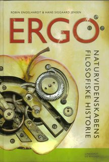

Læs bogen online her under
[Creative Common Licence](https://creativecommons.org/licenses/by-nc-sa/3.0/)

### Praktisk info

Først udgivet i 2007 på forlaget Linhardt og Ringhof, er bogen "ERGO - Naturvidenskabens filosofiske historie" af Robin Engelhardt og Hans Siggaard Jensen her gjort tilgængelig på nettet. Fra indholdfortegnelsen forneden kan hvert enkelt kapitel og underkapitel læses separat som pdf. Hvis du vil samle dit eget udvalg af sider fra bogen, skal du altså bare downloade de respektive sider.

Den rigtige, fysiske bog kan stadig købes hos enkelte boghandlere. Det er en indbunden udgave af høj kvalitet med over 200 illustrationer i farver og trykt på tykt papir. Jeg har også enkelte eksemplarer tilbage, hvis det har interesse. Se kontakt forneden. Og hvis det ikke kan være anderledes, kan du også downloade

hele bogen på een gang.
 
 

**ERGO - Naturvidenskabens Filosofiske Historie, 
Robin Engelhardt og Hans Siggaard Jensen, 
456 sider, Linhardt og Ringhof, 2007, ISBN 9788759528662** 

  
  

  

Forord, 9

Indledning, 11

Kapitel 1: De første teorier om verden, 17-53

De første teorier om verden, 17

Verden kan forstås, 21

Sansernes og forstandens tvivlsomme brugbarhed, 25

Atomer og det tomme rum, 30

De platoniske sfærer, 33

Aristoteles og de athenske akademier, 34

Passer og lineal, 38

Heureka for tankeeksperimentets sejr, 42

Jorden placeres i centrum, 43

Den antikke lægekunst, 47

Teori og praksis, 50

Kapitel 2: Katekismus og kulturudveksling, 55-75

Katekismus og kulturudveksling, 55

Håndværkerglæde og opdagertrang, 57

Etableringen af universiteterne, 59

Etableringen af universiteterne, 59

Det arabiske talsystem, 67

Overtro som katalysator for indsigt, 70

Teknologiske fremskridt i skrift og bogtryk, 74

Kapitel 3: Videnskabsmandens og humanistens fødsel, 77-123

Videnskabsmandens og humanistens fødsel, 77

Det skabende menneske, 78

Det dobbelte bogholderi og centralperspektivet, 83

Den videnskabelige revolution – opgøret med Aristoteles, 88

Kortlægningen af den ydre og indre verden, 90

Lad kendsgerningerne tale, 96

Naturlove som norm, 102

En mekanisk og deterministisk verdensorden, 106

Om at erkende verden – den moderne filosofi, 111

Formler for det uendelige og det tilfældige, 117

Kapitel 4: Samfundsinstitutionen bygges op, 125-171

Samfundsinstitutionen bygges op, 125

Mécanique Analytique, 128

Hume og Kant, 134

Revolution!, 139

Romantisk videnskab, 143

Geniet på arbejde, 147

Arbejdsdeling og teknisk rationalitet, 150

Kritik af aprioriet, 160

Mekanisk manipulerbar materie, 164

Victorianisme og positivisme i videnskab og teknologi, 168

Kapitel 5: Etableringen af de videnskabelige discipliner, 173-223

Etableringen af de videnskabelige discipliner, 173

Den levende kraft – energi og varme, 174

Lad der blive lys, 180

Alting i udvikling, 184

Lægen og sæben, 191

Introspektion, 199

Hvad er et tal?, 209

Den sproglige vending i filosofien, 216

Forskningsmetode, 220

Kapitel 6: Drømmen om enhed, 225-257

Drømmen om enhed, 225

Året 1905, 228

En omvending af alle begreber og forestillinger, 234

Vores plads i kosmos, 237

Atomets struktur, 242

Usikkerhedsprincippet, 246

Komplementaritet fra København, 248

Atomare fristelser, 251

Disintegration eller enhed?, 253

Eksotiske tilstande, 255

Kapitel 7: I selverkendelsens lys, 259-299

I selverkendelsens lys, 259

Formaliseringens grænser i matematik og logik, 261

Gödels bevis, 268

Turing og den universelle maskine, 270

Informationsbegrebet, 274

Beregningens grænser, 282

Universet som laptop, 284

Kaos og ikke-lineære erkendelser, 287

Naturens fraktale geometri, 289

Den statistiske vending, 293

Fuzzy tænkning, 295

Betingede sandheder, 297

Kapitel 8: Kulturens videnskabeliggørelse, 301-341

Kulturens videnskabeliggørelse, 301

Arbejdsdeling og masseproduktion, 303

Moderne tider, 308

Videnskaben forsøges forstået, 317

Videnskabsfilosofi som ny disciplin, 319

Hvad står øverst – fysik eller metafysik?, 325

Falsifikation og paradigmer, 329

Socialkonstruktivisme, 333

Statistisk signifikans – et lærestykke, 338

Kapitel 9: Det evolutionære verdenssyn, 343-379

Det evolutionære verdenssyn, 343

    

Det eugeniske program, 344

    

Den moderne syntese, 349

    

Økologi og bioteknologi, 352

    

Darwins mange små børn, 355

   

Out of Africa, 359

   

Livets oprindelse, 364

     

Fra designargumenter til selvorganisering, 369

    

Teorier om spil, spas og samarbejde, 372

    

Evolutionær psykologi, 377

    

Kapitel 10: Netværksvidenskab, 381-419

Netværksvidenskab, 381

Økosystemers kompleksitet, 382

Selvorganiserende kritiske netværk, 387

Verden kan fortælles, 389

Netværk i kroppen, 392

Netværk i hovedet, 394

Bevidsthedens landskaber, 398

AI, AL og kunstige neurale netværk, 402

Den digitale overtagelse, 405

Små verdener, 412

Rumskibet Jorden, 415

Litteraturliste, 420-425

Index, 426-455

